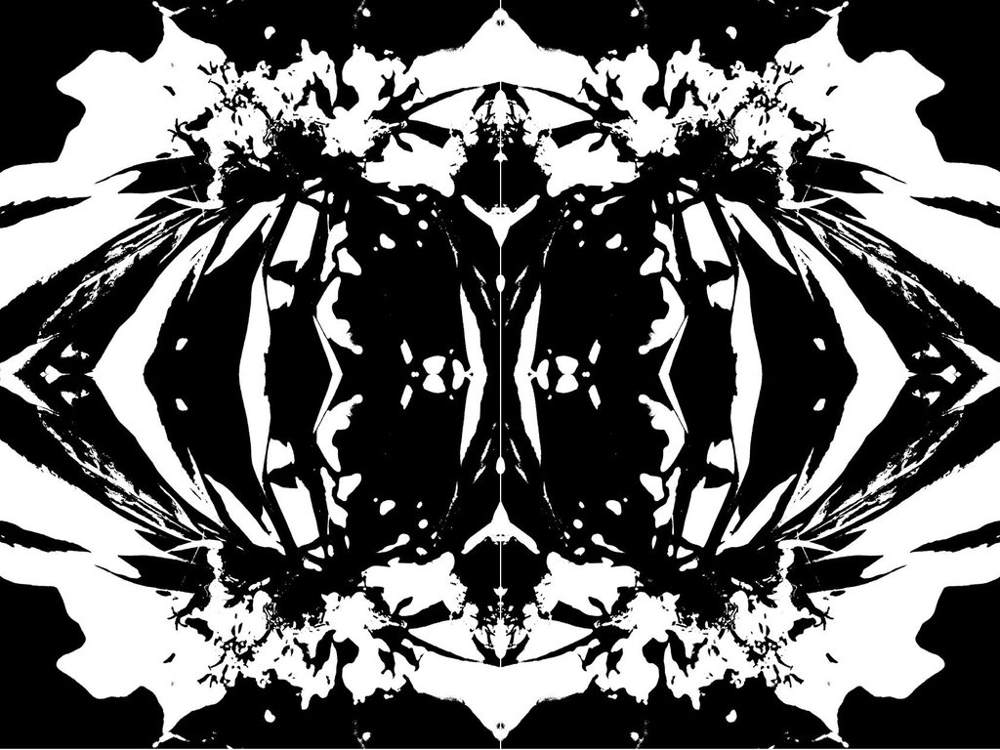

Í þessu verkefni eigið þið að skrifa forrit sem greinir myndir. Mynd er geymd
sem tvívítt fylki af stærð $n\times m$, þar sem hvert stak í fylkinu er
annaðhvort &lsquo;<tt>#</tt>&rsquo; (sem táknar svartan punkt) eða
&lsquo;<tt>.</tt>&rsquo; (sem táknar hvítan punkt).

Forritið byrjar á að lesa inn tvær heiltölur $n$ og $m$. Þar á eftir fylgja $n$
línur, hver þeirra með $m$ stöfum, sem táknar myndina eins og henni er lýst að
ofan.

Forritið á svo að greina hvort myndin sé samhverf um miðjuna lóðrétt. Við
köllum svoleiðis mynd spegilmynd. Eftirfarandi mynd er því spegilmynd.

Forritið skrifar út eina línu sem er &ldquo;<tt>Spegilmynd</tt>&rdquo; ef
myndin er spegilmynd, en &ldquo;<tt>Ekki spegilmynd</tt>&rdquo; annars.

