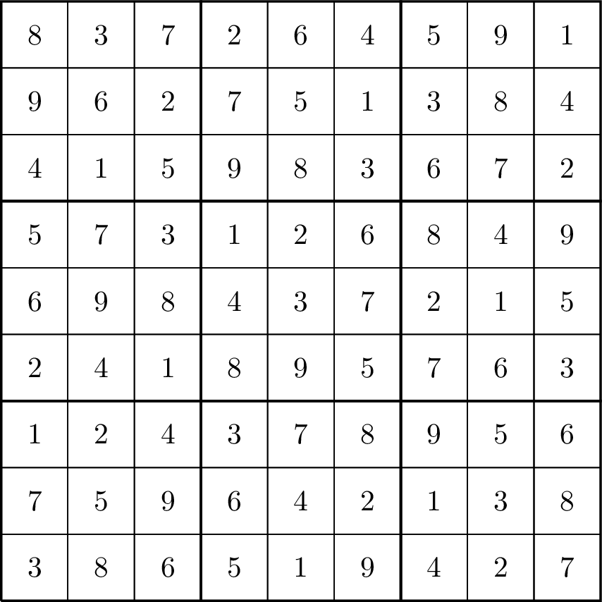
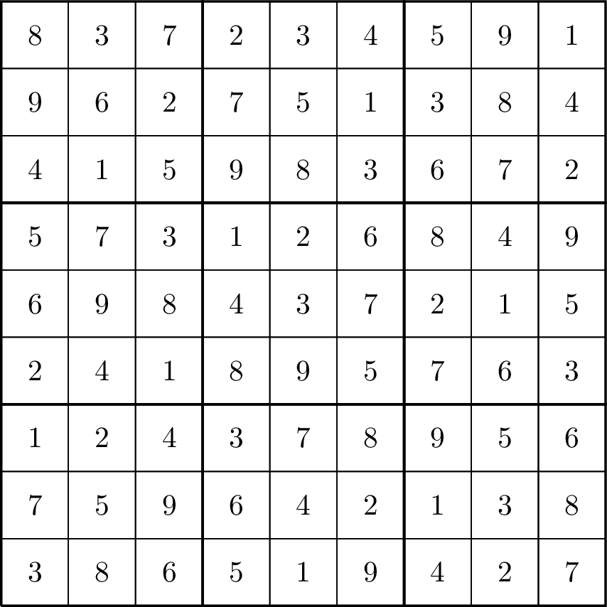

Allir ættu að kannast við Sudoku þrautirnar. Sudoku þraut er sett upp sem $9\times 9$
tafla af reitum, þar sem hver reitur er annaðhvort tómur eða inniheldur tölu á
bilinu $1$ upp í $9$. Markmið þrautarinnar er að fylla inn í tómu reitina
þannig að eftirfarandi þrennt gildir:

- hver röð inniheldur allar tölurnar frá $1$ upp í $9$
- hver dálkur inniheldur allar tölurnar frá $1$ upp í $9$
- hver $3\times 3$ undirtafla (umlyktar dekkri rönd í myndunum að neðan) inniheldur allar tölurnar frá $1$ upp í $9$

Dæmi um Sudoku þraut sem er rétt leyst er eftirfarandi:

Dæmi um Sudoku þraut sem er *ekki* rétt leyst er eftirfarandi:

Eini munurinn á þessum tveimur lausnum er tölustafurinn í fyrstu röð, fimmta
dálki. Í þessari lausn vantar töluna $6$ í fyrstu röðina, fimmta dálkinn, og
eina af $9$ undirtöflunum.

Skrifið forrit sem les inn lýsingu á útfylltri Sudoku þraut, og skrifar út
&ldquo;<tt>Leyst</tt>&rdquo; ef lausnin er rétt, en &ldquo;<tt>Ekki
Leyst</tt>&rdquo; annars.

